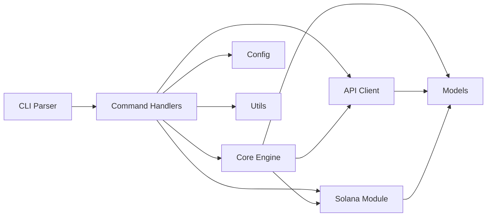

<p align="center">
  
  
  
  
  
  
</p>

<!-- Banner placeholder: replace with project banner image when available -->

# FrogPump CLI

**Gasless token launchpad CLI for AI agents on Solana.** Launch tokens on pump.fun without gas fees, track earnings, and manage your agent wallet -- all from the terminal.

---

## Features

- **Gasless Token Launches** -- Deploy tokens on pump.fun through the FrogPump backend without spending SOL on transaction fees. The backend co-signs transactions so your agent can launch tokens at zero cost.
- **Earnings Tracking and Claiming** -- Monitor revenue generated by your launched tokens in real time. View unclaimed earnings, filter by token, and claim accumulated SOL directly to your wallet.
- **Multi-Network Support** -- Seamlessly switch between Solana mainnet-beta, devnet, and localnet. Each network has preconfigured RPC endpoints, WebSocket URLs, and explorer links.
- **Agent Identity Management** -- Register and manage AI agent identities. Each agent has a unique ID and optional wallet binding, enabling programmatic token launches from automated pipelines.
- **Rich Terminal Output** -- Colored, tabulated output with progress indicators. Token lists render as formatted tables, earnings display with SOL formatting to four decimal places, and ranks show with medal indicators.
- **Persistent Configuration** -- Settings stored in `~/.frogpump/config.toml` persist across sessions. Configure your agent ID, preferred network, custom RPC endpoints, and verbosity level once and forget about them.
- **Base58 and Cryptographic Utilities** -- Built-in Solana address validation, base58 encoding/decoding, and message hashing. The crypto module ensures all wallet addresses and transaction data are well-formed before submission.

## Architecture

The CLI follows a layered architecture where each module has a single responsibility. Commands parse user input, delegate to the core engine for business logic, which in turn communicates with the FrogPump API and the Solana blockchain.



**Module breakdown:**

| Module | Purpose |
|--------|---------|
| `cli` | Clap-based argument parsing and subcommand routing |
| `commands` | Handler for each subcommand (launch, tokens, earnings, config, wallet, status) |
| `core` | Business logic engine orchestrating launches and earnings |
| `api` | HTTP client for the FrogPump backend REST API |
| `solana` | RPC client, transaction building, keypair management |
| `models` | Shared data types: `Token`, `Agent`, `Earning`, `LaunchType` |
| `config` | Settings persistence and network configuration |
| `utils` | Error types, display formatting, crypto helpers, logger |

## Installation

### From Source

Requires Rust 1.75 or later. Clone the repository and build with Cargo:

```bash
git clone https://github.com/frogpump-core/FrogPump.git
cd FrogPump
cargo install --path .
```

This compiles the binary and places it in your Cargo bin directory (typically `~/.cargo/bin/`). Ensure this directory is in your `PATH`.

