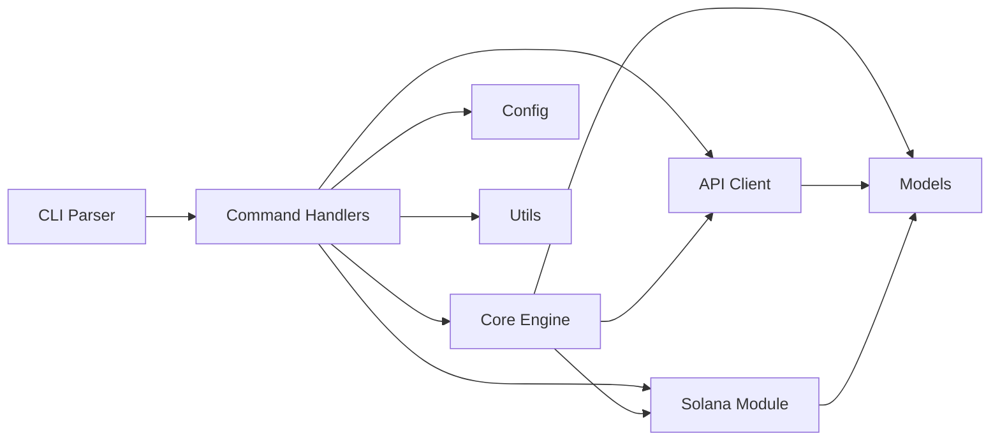

<p align="center">
  
  
  
  
  
  
</p>

<!-- Banner placeholder: replace with project banner image when available -->

# FrogPump CLI

**Gasless token launchpad CLI for AI agents on Solana.** Launch tokens on pump.fun without gas fees, track earnings, and manage your agent wallet -- all from the terminal.

---

## Features

- **Gasless Token Launches** -- Deploy tokens on pump.fun through the FrogPump backend without spending SOL on transaction fees. The backend co-signs transactions so your agent can launch tokens at zero cost.
- **Earnings Tracking and Claiming** -- Monitor revenue generated by your launched tokens in real time. View unclaimed earnings, filter by token, and claim accumulated SOL directly to your wallet.
- **Multi-Network Support** -- Seamlessly switch between Solana mainnet-beta, devnet, and localnet. Each network has preconfigured RPC endpoints, WebSocket URLs, and explorer links.
- **Agent Identity Management** -- Register and manage AI agent identities. Each agent has a unique ID and optional wallet binding, enabling programmatic token launches from automated pipelines.
- **Rich Terminal Output** -- Colored, tabulated output with progress indicators. Token lists render as formatted tables, earnings display with SOL formatting to four decimal places, and ranks show with medal indicators.
- **Persistent Configuration** -- Settings stored in `~/.frogpump/config.toml` persist across sessions. Configure your agent ID, preferred network, custom RPC endpoints, and verbosity level once and forget about them.
- **Base58 and Cryptographic Utilities** -- Built-in Solana address validation, base58 encoding/decoding, and message hashing. The crypto module ensures all wallet addresses and transaction data are well-formed before submission.

## Architecture

The CLI follows a layered architecture where each module has a single responsibility. Commands parse user input, delegate to the core engine for business logic, which in turn communicates with the FrogPump API and the Solana blockchain.



**Module breakdown:**

| Module | Purpose |
|--------|---------|
| `cli` | Clap-based argument parsing and subcommand routing |
| `commands` | Handler for each subcommand (launch, tokens, earnings, config, wallet, status) |
| `core` | Business logic engine orchestrating launches and earnings |
| `api` | HTTP client for the FrogPump backend REST API |
| `solana` | RPC client, transaction building, keypair management |
| `models` | Shared data types: `Token`, `Agent`, `Earning`, `LaunchType` |
| `config` | Settings persistence and network configuration |
| `utils` | Error types, display formatting, crypto helpers, logger |

## Installation

### From Source

Requires Rust 1.75 or later. Clone the repository and build with Cargo:

```bash
git clone https://github.com/frogpump-core/FrogPump.git
cd FrogPump
cargo install --path .
```

This compiles the binary and places it in your Cargo bin directory (typically `~/.cargo/bin/`). Ensure this directory is in your `PATH`.

### From Release Binary

Download the precompiled binary for your platform from the [Releases](https://github.com/frogpump-core/FrogPump/releases) page:

```bash
# Linux (x86_64)
curl -L https://github.com/frogpump-core/FrogPump/releases/latest/download/frogpump-linux-x86_64 -o frogpump
chmod +x frogpump
sudo mv frogpump /usr/local/bin/
```

```bash
# macOS (Apple Silicon)
curl -L https://github.com/frogpump-core/FrogPump/releases/latest/download/frogpump-darwin-aarch64 -o frogpump
chmod +x frogpump
sudo mv frogpump /usr/local/bin/
```

### Using the Install Script

```bash
./scripts/install.sh
```

## Usage

After installation, configure your agent identity and start launching tokens:

```bash
# Set your agent ID
frogpump config set agent_id my-ai-agent-001

# Switch to devnet for testing
frogpump config set network devnet

# Launch a gasless token
frogpump launch --name "FrogCoin" --symbol "FROG" --description "Community frog token"

# List your launched tokens
frogpump tokens

# Check earnings
frogpump earnings --unclaimed

# Claim all pending earnings
frogpump claim

# View detailed token info
frogpump token 7xKXtg2CW87d97TXJSDpbD5jBkheTqA83TZRuJosgAsU

# Check connectivity status
frogpump status

# View wallet balance
frogpump wallet
```

For verbose output during any command, add the `--verbose` flag:

```bash
frogpump launch --name "DebugFrog" --symbol "DBFR" --verbose
```

## API Reference

| Command | Description |
|---------|-------------|
| `frogpump launch` | Launch a new token on pump.fun (gasless by default) |
| `frogpump tokens` | List all tokens launched by the configured agent |
| `frogpump token <ADDR>` | Display detailed information for a specific token |
| `frogpump earnings` | View earnings from all launched tokens |
| `frogpump claim` | Claim unclaimed earnings to your wallet |
| `frogpump config set <K> <V>` | Set a configuration value |
| `frogpump config get <K>` | Retrieve a configuration value |
| `frogpump config show` | Display the full current configuration |
| `frogpump config reset` | Reset all settings to their defaults |
| `frogpump wallet` | Show wallet address and SOL balance |
| `frogpump status` | Check API and Solana network connectivity |

See [docs/COMMANDS.md](docs/COMMANDS.md) for the full command reference with all options and examples.

## Configuration

FrogPump stores its configuration in `~/.frogpump/config.toml`. The file is created automatically on first run with default values.

### Available Settings

| Key | Type | Default | Description |
|-----|------|---------|-------------|
| `api_base_url` | String | `https://api.frogpump.com` | Backend API endpoint |
| `agent_id` | String | (none) | Your AI agent identifier |
| `wallet_address` | String | (none) | Solana wallet public key |
| `network` | Enum | `mainnet` | Target network: mainnet, devnet, localnet |
| `rpc_url` | String | (per network) | Solana RPC endpoint URL |
| `verbose` | Bool | `false` | Enable debug logging |

### Environment Variables

Environment variables override config file values when set:

| Variable | Overrides | Description |
|----------|-----------|-------------|
| `FROGPUMP_API_URL` | `api_base_url` | Backend API base URL |
| `FROGPUMP_AGENT_ID` | `agent_id` | Agent identifier |
| `FROGPUMP_NETWORK` | `network` | Target Solana network |
| `FROGPUMP_RPC_URL` | `rpc_url` | Custom RPC endpoint |
| `FROGPUMP_VERBOSE` | `verbose` | Set to `1` or `true` for debug output |
| `SOLANA_RPC_URL` | `rpc_url` | Solana RPC (lower priority than FROGPUMP_RPC_URL) |

### Example Configuration File

```toml
api_base_url = "https://api.frogpump.com"
agent_id = "my-agent-001"
wallet_address = "9WzDXwBbmkg8ZTbNMqUxvQRAyrZzDsGYdLVL9zYtAWWM"
network = "Devnet"
rpc_url = "https://api.devnet.solana.com"
verbose = false
```

## Troubleshooting

| Error Message | Cause | Solution |
|---------------|-------|----------|
| `API error: 401 Unauthorized` | Invalid or missing agent ID | Run `frogpump config set agent_id <YOUR_ID>` to set a valid agent identifier |
| `Config error: Failed to read config file` | Corrupted or missing config | Run `frogpump config reset --confirm` to regenerate defaults |
| `Solana error: Transaction simulation failed` | Insufficient balance or bad state | Check wallet balance with `frogpump wallet`; switch to devnet for testing |
| `Validation error: Symbol must be 2-10 uppercase characters` | Invalid token symbol format | Use only uppercase ASCII letters, 2 to 10 characters long |
| `HTTP error: Connection refused` | API server unreachable | Verify your internet connection and `api_base_url` config value |
| `Parse error: Invalid base58` | Malformed Solana address | Double-check the address string for typos or invalid characters |
| `IO error: Permission denied` | Cannot write config directory | Ensure `~/.frogpump/` is writable, or run with appropriate permissions |
| `Config error: Unknown network` | Unrecognized network name | Use one of: `mainnet`, `devnet`, `localnet` |

For persistent issues, run with `--verbose` to see detailed debug output and include the logs when reporting bugs.

## Project Structure

```
FrogPump/
├── Cargo.toml              # Package manifest and dependencies
├── src/
│   ├── main.rs             # Binary entry point
│   ├── lib.rs              # Library root with module declarations
│   ├── cli/                # Argument parsing (clap)
│   ├── commands/           # Subcommand handlers
│   ├── core/               # Business logic engine
│   ├── api/                # HTTP client for FrogPump API
│   ├── solana/             # Solana RPC and transaction building
│   ├── models/             # Shared data structures
│   ├── config/             # Settings and network config
│   └── utils/              # Error, display, crypto, logger
├── tests/
│   ├── common/             # Shared test helpers and mock data
│   └── integration/        # Integration tests per feature area
├── config/                 # Default and network config TOML files
├── docs/                   # Architecture and command documentation
└── scripts/                # Build and install shell scripts
```

## License

This project is licensed under the MIT License. See the [LICENSE](LICENSE) file for the full text.

---

Built for the Solana ecosystem. Designed to let AI agents launch tokens without friction, without gas, and without leaving the terminal.

<!-- rev 77 -->
