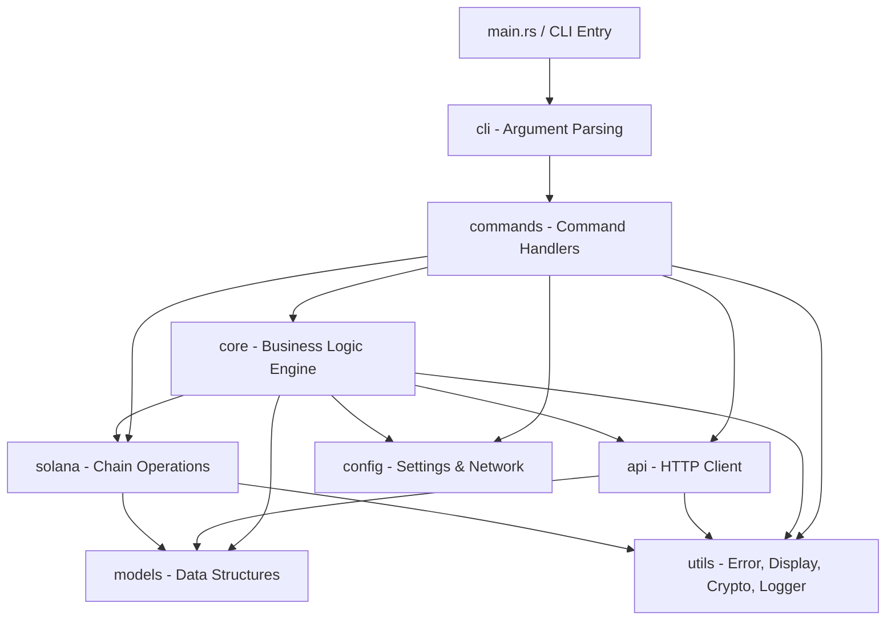

# FrogPump CLI Architecture

## Overview

FrogPump is a gasless token launchpad CLI designed for AI agents operating on the Solana blockchain. The architecture follows a layered design pattern where each layer has a clear responsibility boundary and communicates through well-defined interfaces.

The CLI binary (`frogpump`) serves as the entry point. It parses user commands via `clap`, delegates execution to the appropriate command handler, which in turn calls into the core engine and API client layers. The core engine orchestrates business logic, while the API client handles all HTTP communication with the FrogPump backend. Solana-specific operations (transaction building, signing, RPC calls) are isolated in the `solana` module.

## Module Dependency Diagram

## Module Descriptions

### `src/cli/`
Defines the top-level `clap` argument parser and subcommand enum. Responsible only for parsing raw CLI input into structured command types.

### `src/commands/`
Command handler implementations. Each subcommand (launch, earnings, config, wallet, status) has its own handler module. Handlers orchestrate the flow: validate input, call core/api, format output.

### `src/core/`
The `LaunchEngine` and related business logic. Manages the lifecycle of token launches, earnings calculations, and agent registration. Acts as the mediator between commands and lower-level modules.

### `src/api/`
HTTP client (`ApiClient`) for communicating with the FrogPump backend API. Handles request construction, authentication headers, response parsing, and error mapping.

### `src/solana/`
Solana-specific operations: RPC client wrapper, transaction building, keypair management, and on-chain data queries. Isolated so chain logic never leaks into business logic.

### `src/models/`
Shared data structures: `Token`, `Agent`, `Earning`, and associated enums like `LaunchType`. All models derive `Serialize`/`Deserialize` for JSON and TOML interop.

### `src/config/`
Configuration management: `Settings` (load/save from `~/.frogpump/config.toml`), `Network` enum with per-network URL configs. Supports mainnet, devnet, and localnet.

### `src/utils/`
Cross-cutting utilities: `FrogError` (thiserror-based error enum), display formatting helpers, base58 crypto utils, and a colored logger.

## Data Flow

1. User invokes `frogpump launch --name "FrogToken" --symbol "FROG"`
2. `cli` parses arguments into a `LaunchCommand` struct
3. `commands::launch` handler validates input (name length, symbol format)
4. Handler calls `ApiClient::create_token()` to register the token on the backend
5. Backend returns a mint address; handler calls `solana::build_launch_tx()` to construct the on-chain transaction
6. For gasless launches, the backend co-signs; for self-funded, the local wallet signs
7. Transaction is submitted via the configured RPC endpoint
8. Result is displayed to the user with formatted output (colored, tabulated)

<!-- rev 73 -->
